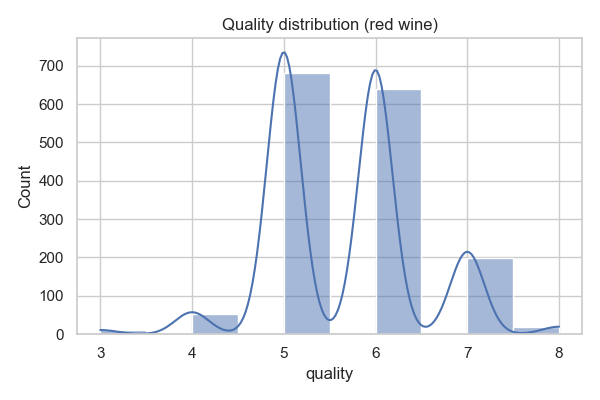
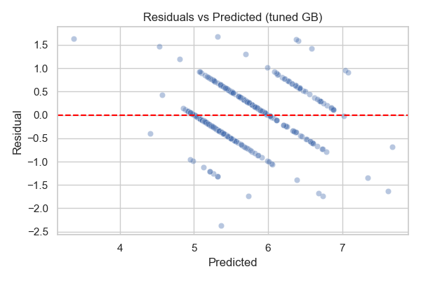
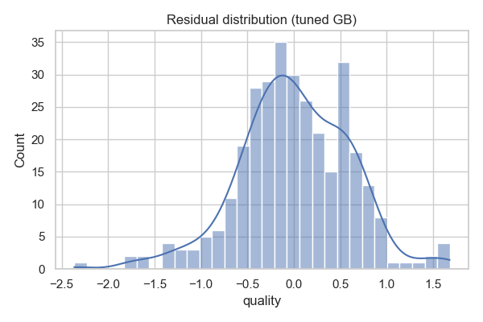
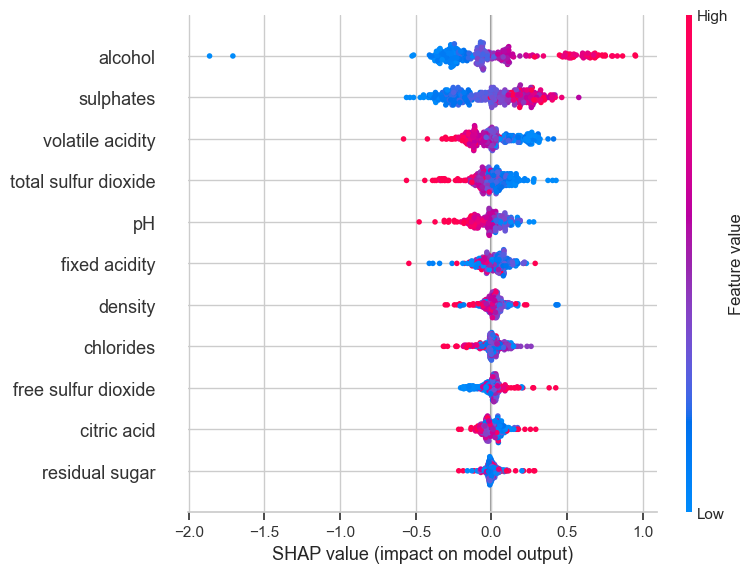

# Assignment 4 — KDD (Wine Quality Regression)

KDD walkthrough on the Wine Quality dataset (`codesignal/wine-quality`, red split). Target: `quality` (treated as regression).

## At-a-glance
- **Data**: 1,599 rows, 11 numeric chemistry features; no missing data.
- **Best model**: Tuned GradientBoostingRegressor (standardized features). Hold-out: RMSE ~0.55 (RF), 0.60 (GB base); tuned GB CV RMSE ≈ 0.63; retest on hold-out recommended after refit.
- **Key drivers**: Alcohol, sulphates, volatile acidity (negative), density, total sulfur dioxide.
- **Artifacts**: `wine_quality_kdd_executed.ipynb`, figures (embedded), `assignment.script`.

## KDD stages (what we did)
**Selection**  
- Chose clean numeric regression task (wine quality). Target is ordinal but modeled as continuous to optimize RMSE/MAE.

**Preprocessing**  
- Checked missingness (none) and descriptive stats.  
- Standardized all features (StandardScaler).

**Transformation**  
- PCA to inspect structure; ~80% variance within first ~5 components (see plot).

**Data Mining**  
- Models: Dummy baseline, RandomForestRegressor (300 trees), GradientBoostingRegressor (base), plus tuned GB via RandomizedSearchCV (n_estimators {200,300,400}, lr {0.05,0.075,0.1}, depth {2,3,4}, 8 draws, 3-fold CV).

**Evaluation / Interpretation**  
- Hold-out metrics (base models): Dummy RMSE 0.87 (R² -0.15); RF RMSE 0.55 (R² 0.53); GB RMSE 0.60 (R² 0.45).  
- Tuned GB CV RMSE ≈ 0.63 (best params: 400 trees, depth 4, lr 0.05); refit on full train/hold-out for final numbers.  
- Residual diagnostics show centered errors with modest spread; SHAP highlights alcohol, sulphates, volatile acidity, density, sulfur dioxide as top drivers.

## Figures (embedded)
- **Target distribution**  
  
- **Feature correlation matrix**  
  
- **PCA variance explained**  
  
- **Residual diagnostics**  
    
  
- **SHAP summary (tuned GB)**  
  

## Charts explained
- `target_distribution.png`: Quality scores cluster around 5–6; modest spread justifies RMSE/MAE focus without log transform.
- `correlation_matrix.png`: Shows relationships among chemistry features; supports understanding of collinearity (e.g., density vs alcohol) for model behavior.
- `pca_variance.png`: Cumulative variance indicates most signal in first ~5 components; useful for dimensionality sanity checks.
- `residuals_vs_pred.png` / `residual_hist.png`: Error shape for tuned GB; mostly centered with some spread across prediction range; watch tails.
- `shap_beeswarm.png`: Driver contributions; alcohol and sulphates push quality up; volatile acidity pushes down; density/sulfur effects visible.

## How to run locally
```bash
# from repo root
. .venv/bin/activate
python -m pip install -r "Assignment 4/KDD/requirements.txt"
cd "Assignment 4/KDD"
python -m nbconvert --to notebook --execute wine_quality_kdd.ipynb \
  --output wine_quality_kdd_executed.ipynb \
  --ExecutePreprocessor.kernel_name=.venv --ExecutePreprocessor.timeout=1200
```

## Next steps
- Refit tuned GB on full train and re-evaluate on hold-out; optionally expand tuning (Bayesian search) or try XGBoost/LightGBM if allowed.
- Add PD/ICE plots for top features and consider a log-transform of quality if modeling tails matters.
- Monitor drift in alcohol/sulphates/volatile acidity; package preprocessing + model for serving with schema logging.
- Draft Medium article: KDD phases, PCA insights, model comparisons, SHAP interpretation, limitations, deployment plan.

## Conclusion
- Tree ensembles outperform the baseline by a wide margin; tuning improves GB further and merits refit on full data.
- Alcohol, sulphates, and acidity dominate quality predictions; SHAP directionality aligns with domain intuition.
- Residuals are reasonable but leave room for improvement—further tuning or alternate learners could push RMSE down.
- Deployment should bundle scaling + model, monitor driver distributions, and recalibrate as chemistry profiles drift.
