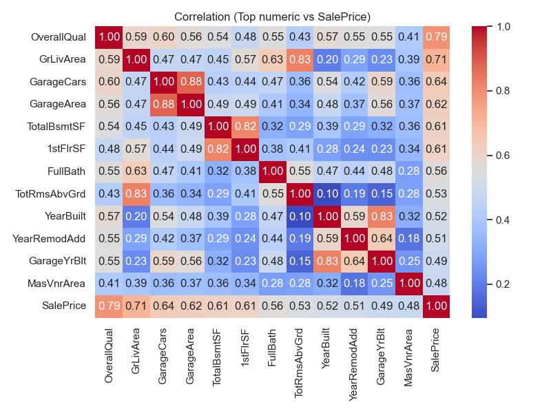
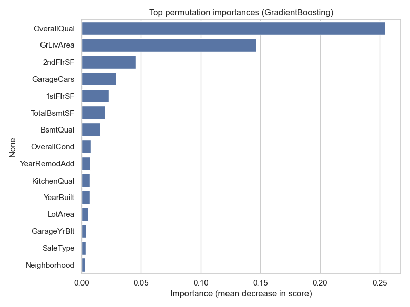
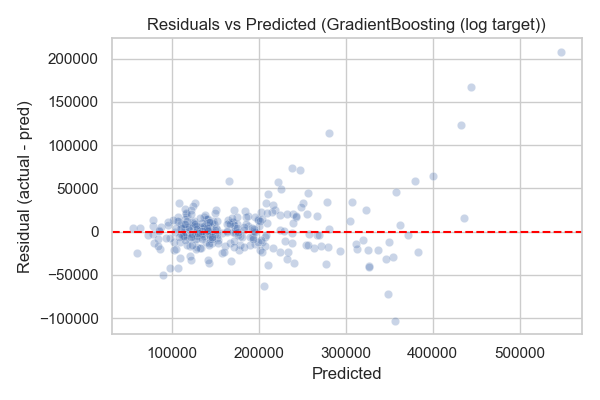
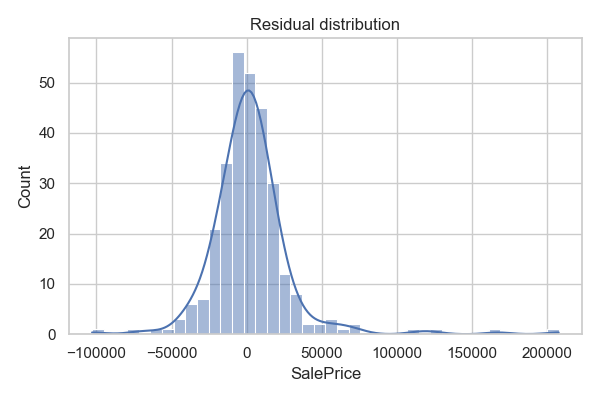
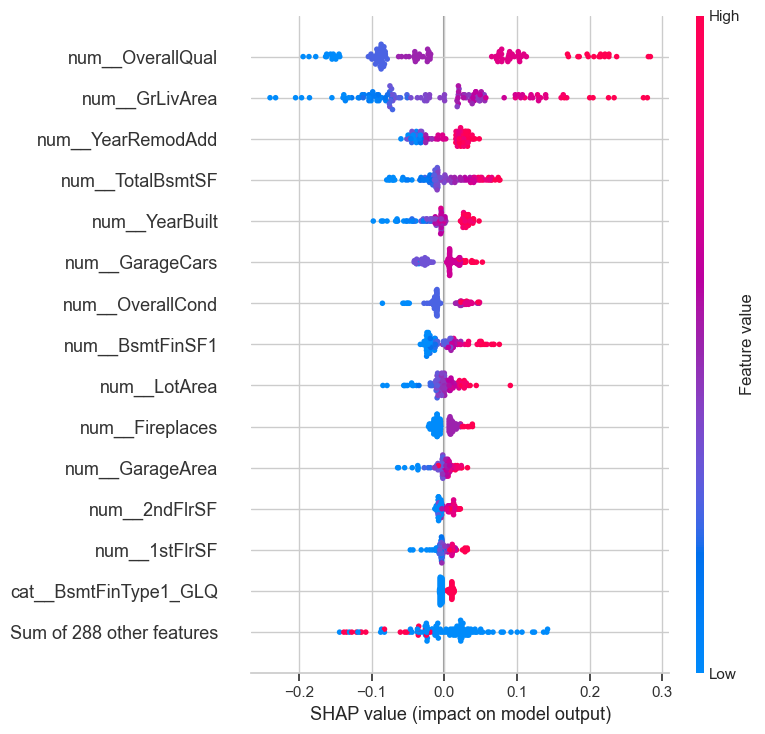
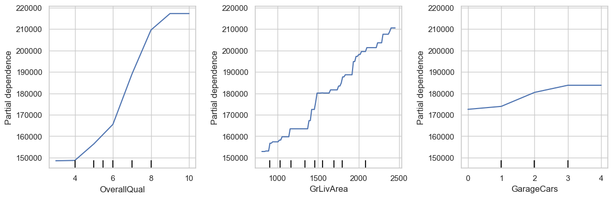

# Assignment 4 — CRISP-DM (House Prices)

CRISP-DM walkthrough on the Hugging Face version of the Kaggle House Prices dataset (`michaelmallari/house-prices-advanced-regression-techniques`). Target: `SalePrice` (regression). Best model: log-target GradientBoosting with CV-tuned hyperparameters.

## At-a-glance
- **Data**: 1,460 rows, 79 mixed numeric/categorical features; target is right-skewed `SalePrice`.
- **Best model**: GradientBoosting (log target). Hold-out RMSE 27,626; MAE 16,654; R² 0.900. CV-tuned candidate: n_estimators=200, learning_rate=0.125, max_depth=3 (CV RMSE ≈ 26,457).
- **Key drivers**: Overall quality, above-ground living area, garage capacity/area, basement size, year built/remodeled.
- **Artifacts**: `house_prices_crispdm_executed.ipynb`, figures (embedded below), `assignment.script` (video narration).

## CRISP-DM phases (what we did)
**1) Business understanding**  
- Goal: predict sale price for residential properties to support valuation/underwriting; emphasize interpretability of drivers and stability across slices (neighborhood/house style).

**2) Data understanding**  
- Loaded from HF `datasets`; 79 features, no target leaks. Checked missingness and distributions.  
- Target is right-skewed → log transform considered.  
- Correlations highlight quality, living area, basement, garage features.

**3) Data preparation**  
- Train/test split (80/20, random_state=42).  
- Numeric: median impute. Categorical: most-frequent impute + one-hot (ColumnTransformer).  
- Kept all features; no manual drops to preserve breadth for trees.

**4) Modeling**  
- Baseline: DummyRegressor (median).  
- Models: RandomForest(200), GradientBoosting, GradientBoosting with log target (TransformedTargetRegressor).  
- Tuning: RandomizedSearchCV (12 draws, 3-fold) on log-target GB (n_estimators ∈ {200,300,400,500}, learning_rate ∈ {0.05,0.075,0.1,0.125}, max_depth ∈ {2,3,4}).  
- Metrics: RMSE/MAE/R² on hold-out; CV RMSE for tuning.

**5) Evaluation**  
- Hold-out results (20% split):  
  - Dummy: RMSE 88,667 | MAE 59,568 | R² -0.025  
  - RandomForest: RMSE 29,104 | MAE 17,577 | R² 0.890  
  - GradientBoosting: RMSE 27,828 | MAE 17,319 | R² 0.899  
  - **GradientBoosting (log target)**: **RMSE 27,626 | MAE 16,654 | R² 0.900**  
  - Tuned GB (log target, CV): CV RMSE ≈ 26,457 (n_estimators=200, lr=0.125, depth=3)  
- Stability: 3-fold CV RMSE mean 27,650 (std 3,106) on selected best_pipe.

**6) Deployment planning**  
- Bundle preprocessing + model via `joblib`/`skops`; expose behind FastAPI/Flask.  
- Monitor slice MAE (neighborhood, house style) and drift; retrain/re-tune periodically.  
- Keep SHAP/PD plots for model cards and dashboards; log schema and feature pipeline.

## Figures (embedded)
- **Target distribution**  
  

- **Top numeric correlations vs SalePrice**  
  

- **Permutation importances (raw columns)**  
  

- **Residual diagnostics**  
    
  

- **SHAP summary (log-target GB)**  
  

- **Partial dependence (OverallQual, GrLivArea, GarageCars)**  
  

- **Slice MAE (Neighborhood top-8, HouseStyle)**  
  

## Charts explained
- `target_distribution.png`: SalePrice histogram shows right skew; motivates log-target modeling to stabilize variance.
- `correlation_top_numeric.png`: Heatmap of top numeric correlations vs SalePrice, surfacing strongest linear drivers (quality, living area, basement, garage).
- `permutation_importance.png`: Global importance (raw columns) confirming the main structural features.
- `residuals_vs_pred.png` / `residual_hist.png`: Error shape and where errors widen—high-price homes show larger dispersion.
- `shap_beeswarm.png`: Model-agnostic contributions; directionality and magnitude align with permutation, reinforcing trust in the signals.
- `pdp_top_features.png`: Partial dependence for key drivers; mostly monotonic lift for quality, living area, garage capacity.
- `group_mae.png`: Slice MAE across neighborhoods/house styles; highlights segments (e.g., NridgHt) with higher error that merit monitoring or feature refinement.

## Slice/reflection highlights
- Largest errors on high-price homes; `NridgHt` neighborhood shows elevated MAE (~46k).  
- Consistent drivers across permutation, SHAP, and PDP: quality, living area, garage, basement, year built/remodeled.  
- Log-target improves error metrics; tuned GB candidate via CV appears stronger—refit on full train if deploying.

## How to run locally
```bash
# from repo root
. .venv/bin/activate
python -m pip install -r "Assignment 4/CRISP-DM/requirements.txt"
cd "Assignment 4/CRISP-DM"
python -m nbconvert --to notebook --execute house_prices_crispdm.ipynb \
  --output house_prices_crispdm_executed.ipynb \
  --ExecutePreprocessor.kernel_name=.venv --ExecutePreprocessor.timeout=1400
```

## Next steps
- Refit tuned GB (log-target) on full train + evaluate on hold-out; consider a slightly larger/Bayesian search.  
- Add fairness checks (slice MAE/SHAP by neighborhood, house style).  
- Package model + pipeline; add monitoring (drift, slices, latency) if serving.  
- Draft Medium article covering CRISP-DM phases, EDA, model comparisons, interpretability, limitations, and deployment plan.

## Conclusion
- The log-target GradientBoosting clearly outperforms baselines; CV tuning suggests an even stronger config worth refitting on full train/hold-out.
- Driver stability across permutation, SHAP, and PDP increases interpretability confidence; quality, living area, garage, and basement are consistently top.
- Residuals and slice MAE show weaknesses on expensive properties and specific neighborhoods/house styles—prioritize feature work and fairness checks there.
- Deployment should package preprocessing + model, monitor slice metrics and drift, and re-tune as distributions shift.
