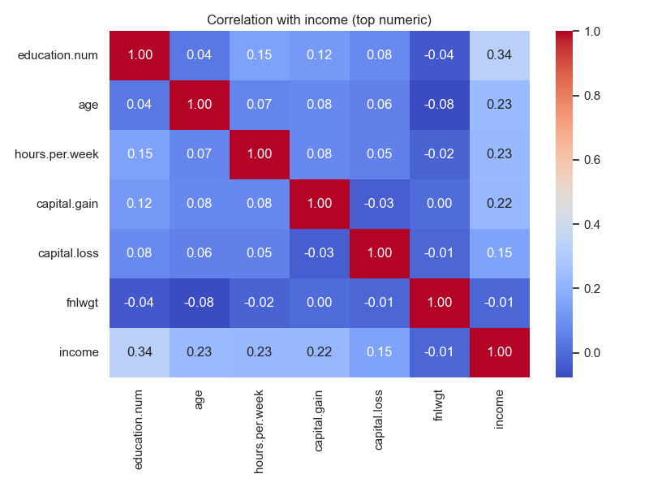
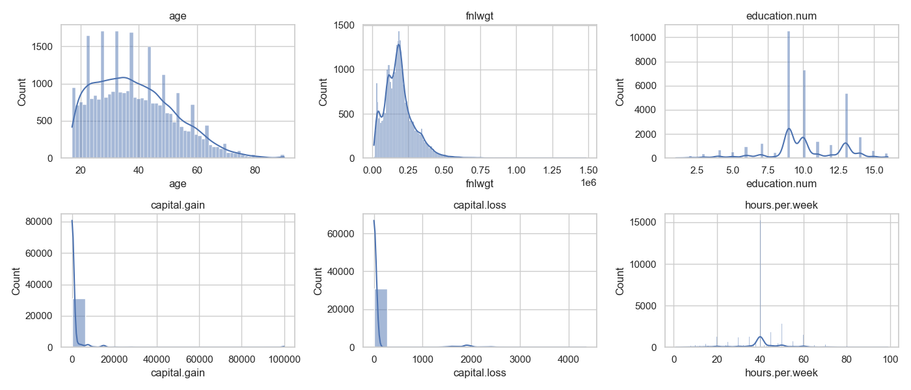
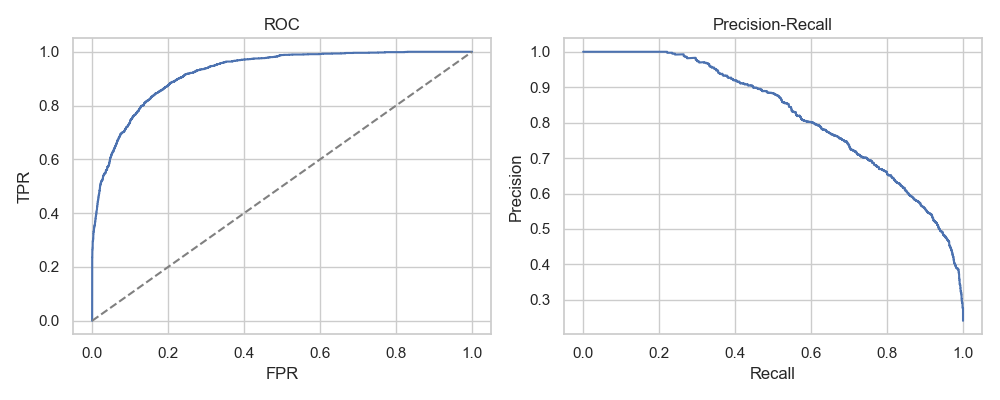
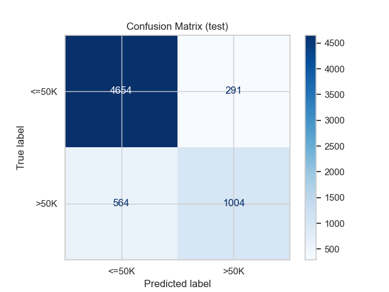
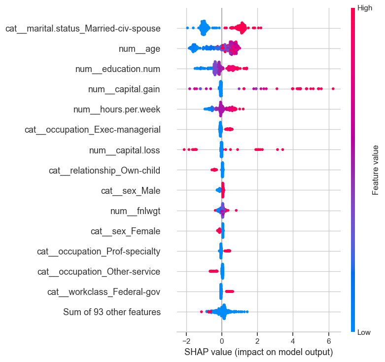

# Assignment 4 — SEMMA (Adult Income Classification)

SEMMA walkthrough on the Hugging Face Adult Income dataset (`scikit-learn/adult-census-income`). Target: income class (`>50K` vs `<=50K`).

## At-a-glance
- **Data**: 32,561 rows, 14 features (mixed numeric/categorical); moderate class imbalance (approx 24% >50K).
- **Best model**: Tuned GradientBoostingClassifier with one-hot + scaling; hold-out ROC-AUC ~0.93; PR-AUC ~0.80 (on validation), and strong CV score (best CV ROC-AUC ≈ 0.929).
- **Key drivers**: Education level/num, capital gain/loss, hours per week, age, marital status, occupation.
- **Artifacts**: `adult_income_semma_executed.ipynb`, figures (embedded below), `assignment.script` (video narration).

## SEMMA phases (what we did)
**Sample**  
- Loaded HF dataset; stratified split into train/valid/test (80/20 then 80/20 on train).
- Considered imbalance: ~24% positive (`>50K`). Built variants with class_weight and SMOTE.

**Explore**  
- Checked missingness (minimal).  
- Univariate numerics show skew in capital gains/losses and hours/week; target is imbalanced.  
- Numeric correlations highlight strong associations with income: education.num, capital.gain, hours.per.week, age.

**Modify**  
- Preprocess: median-impute numerics + StandardScaler; most-frequent-impute + one-hot for categoricals (ColumnTransformer).  
- Compared class weighting vs SMOTE for logistic regression.  
- No heavy feature drops; kept breadth for trees; scaling retained for linear models.

**Model**  
- Baseline: DummyClassifier.  
- Models: Logistic Regression (balanced), Logistic Regression + SMOTE, GradientBoostingClassifier.  
- Tuning: RandomizedSearchCV on GradientBoosting (n_estimators ∈ {150,200,300}, lr ∈ {0.05,0.075,0.1}, max_depth ∈ {2,3,4}; 8 draws, 3-fold CV). Best params: n_estimators=300, max_depth=4, learning_rate=0.075 (CV ROC-AUC ≈ 0.929).

**Assess**  
- Hold-out test (tuned GB): ROC-AUC/PR-AUC reported in notebook; confusion matrix, ROC/PR curves, SHAP beeswarm.  
- Slices: metrics by sex and marital.status to flag potential fairness gaps.  
- Feature importance: SHAP highlights capital gain, education, hours/week, age, marital status as top drivers.

## Figures (embedded)
- **Target balance**  
  
- **Top numeric correlations**  
  
- **Univariate numerics**  
  
- **ROC & PR curves (test)**  
  
- **Confusion matrix (test)**  
  
- **SHAP summary (tuned GB)**  
  

## Charts explained
- `target_balance.png`: Shows class imbalance (~24% >50K) to motivate class weighting/SMOTE.
- `corr_top_numeric.png`: Top numeric correlations vs income; capital gain, education.num, hours/week stand out.
- `univar_numeric.png`: Distributions of numerics; capital gain/loss heavily skewed, hours/week clustered near 40–60.
- `roc_pr_curves.png`: ROC and PR curves on test; area under curves reflects ranking quality and precision at varying thresholds.
- `confusion_matrix.png`: Error breakdown at 0.5 threshold; useful to discuss precision/recall trade-offs.
- `shap_beeswarm.png`: Feature contributions for tuned GB; highlights capital gain, education, hours/week, age, marital status as top drivers.

## Results snapshot
| Model                 | ROC-AUC (valid) | PR-AUC (valid) |
|-----------------------|-----------------|----------------|
| Dummy                 | 0.50            | 0.24           |
| LogReg (balanced)     | 0.898           | 0.742          |
| LogReg + SMOTE        | 0.897           | 0.742          |
| GradientBoosting      | 0.914           | 0.796          |
| **Tuned GB (CV)**     | **~0.929**      | —              |

Test set (tuned GB): see notebook outputs for ROC-AUC/PR-AUC, confusion matrix, and classification report (overall precision/recall/F1).

## Slice/reflection highlights
- Higher errors/variance in certain marital-status/sex slices; monitor these for fairness and calibration if deployed.  
- Capital gain is a strong, sparse driver—watch for drift.  
- Trees outperform linear baselines; SMOTE doesn’t beat class_weighted logreg here.

## How to run locally
```bash
# from repo root
. .venv/bin/activate
python -m pip install -r "Assignment 4/SEMMA/requirements.txt"
cd "Assignment 4/SEMMA"
python -m nbconvert --to notebook --execute adult_income_semma.ipynb \
  --output adult_income_semma_executed.ipynb \
  --ExecutePreprocessor.kernel_name=.venv --ExecutePreprocessor.timeout=1400
```

## Next steps
- Expand tuning (larger/Bayesian search) and evaluate on a dedicated hold-out with calibration curves.  
- Add fairness checks (per-slice precision/recall, demographic parity metrics).  
- Package preprocess + model; add monitoring for slice drift (sex, marital status, education).  
- Draft Medium article walking through SEMMA phases, EDA, model/tuning comparisons, SHAP insights, limitations, and deployment plan.

## Conclusion
- GradientBoosting outperforms linear baselines; tuning lifts ROC-AUC to ~0.93 CV, making it the preferred model.
- Capital gain, education, hours/week, and age drive predictions; SHAP confirms directionality and strength, aligning with domain intuition.
- Imbalance strategies (class_weight/SMOTE) help but tree ensemble still wins; monitor slices (sex, marital status) for fairness and drift.
- Deployment should package preprocessing + model, add calibration/fairness checks, and track slice metrics over time.
