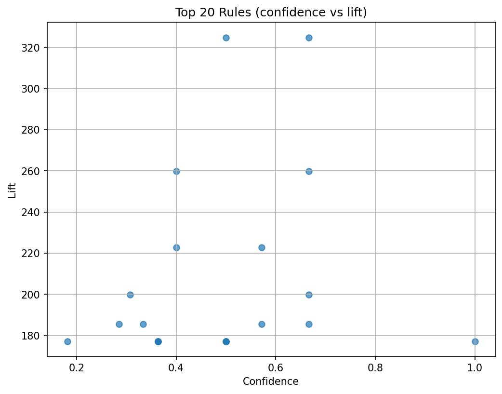

# Association Rules (Groceries Basket)

- Data: `../data/Groceries_dataset.csv` with `Member_number`, `Date`, `itemDescription`.
- Environment: Python 3.11, `pycaret==3.3.0` (no `pycaret.arules`), so the notebook uses `mlxtend`’s Apriori and `association_rules`.
- Flow: group items per member -> one-hot encode with `TransactionEncoder` -> mine frequent itemsets (`apriori`) -> derive rules (`association_rules`) -> sort by lift/confidence -> save CSVs and a scatter plot of top rules.
- Outputs: `frequent_itemsets.csv`, `association_rules.csv`, and `rules_scatter.png`.
- Visuals: 
- Run: execute the notebook end-to-end in the `.venv`; no separate model file is produced. Adjust `min_support`/`min_metric` if you want denser or sparser rules. This replaces `pycaret.arules` (removed in 3.x) with `mlxtend`, differing from other tasks that stay within PyCaret APIs.
