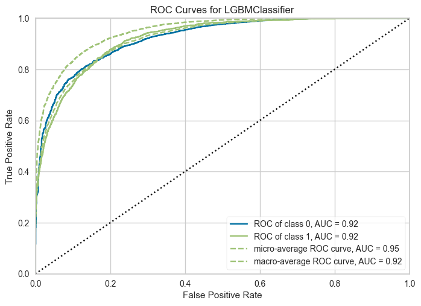

# Binary Classification (Adult Income)

- Data: `../data/adult.csv`, target `income` (>50K vs <=50K). Imbalanced, categorical-heavy; PyCaret handles encoding/imputation automatically.
- Flow: load -> `setup(..., use_gpu=False, fix_imbalance=True, normalize=True)` -> `compare_models` -> `tune_model` -> plots (AUC, Precision-Recall, Confusion Matrix) -> `finalize_model` -> `predict_model` -> `save_model` (`binary_income_model`).
- Outputs: `AUC.png`, `Precision Recall.png`, `Confusion Matrix.png`, and `binary_income_model.pkl` (used by Gradio income tab).
- Visuals:   
- Env/run: Python 3.11 `.venv`, `pycaret==3.3.0`; run `binary_classification_pycaret.ipynb` top-to-bottom (CPU). This low-code approach differs from earlier CRISP/SEMMA notebooks by delegating preprocessing/selection to PyCaret’s `setup`/`compare_models` instead of hand-built pipelines.
