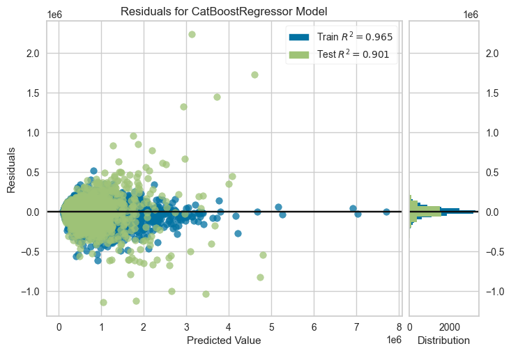

# Regression (King County House Sales)

- Data: `../data/kc_house_data.csv`, target `price`.
- Flow: load -> `setup(..., use_gpu=False)` -> `compare_models` -> `tune_model` -> plots (Residuals, Feature Importance, Prediction Error) -> `finalize_model` -> `predict_model` -> `save_model` (`regression_kc_house_model`).
- Outputs: `Residuals.png`, `Feature Importance.png`, `Prediction Error.png`, and `regression_kc_house_model.pkl` (used by Gradio regressor tab).
- Visuals:   
- Run: execute `regression_pycaret.ipynb` end-to-end in the `.venv` (CPU). PyCaret handles preprocessing/selection; contrast with earlier CRISP-DM regression where feature engineering and tuning were manual.
