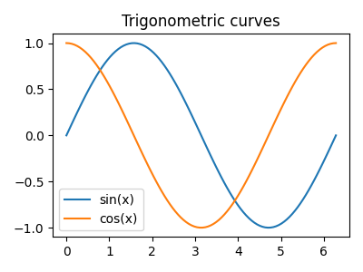

# Derek Banas Python Tutorial — Run Results

Notebook: `derek_banas_python.ipynb`

## What was executed
- Core Python syntax: math, strings, lists/tuples/sets/dicts, comprehensions.
- Control flow: conditionals, loops, fizzbuzz.
- Functions: *args/**kwargs, lambdas, map/filter/reduce.
- Exceptions and context managers (temp file demo).
- Classes/inheritance + magic methods.
- Generators and decorators.
- File I/O (CSV write/read), regex, imports.
- Added a quick Matplotlib demo for graphics.

## Generated outputs
- Standard printouts from each section verifying behavior.
- CSV file written/read during run (`people.csv`, small demo file).
- Plot image saved as `derek_plot.png` (sin/cos curves) and rendered inside the notebook.

