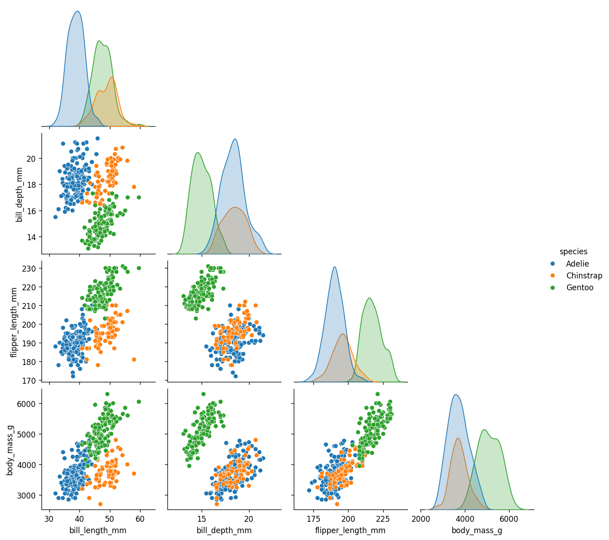
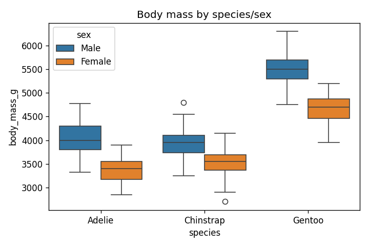
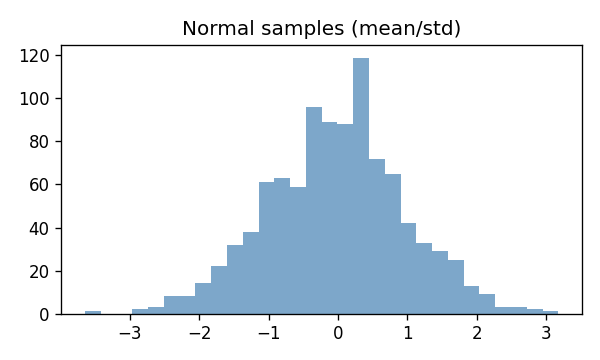

# Pandas & NumPy Advanced Walkthrough — Run Results

Notebook: `pandas_numpy_advanced.ipynb` (executed)

## Highlights
- Dataset: Seaborn penguins (cleaned with `dropna`).
- Pandas: inspection (`info`, `describe`), filtering/sorting, groupby + multi-agg, pivot, merge with metadata, rolling window mean, pairplot and boxplot visualizations.
- NumPy: vectorization/broadcasting, boolean masking, linear algebra solve/eigvals, random sampling/stats with histogram.

## Generated artifacts
- `ec_penguins_pairplot.png` — pairplot of bill/wing/body metrics colored by species.
- `ec_penguins_box.png` — body mass by species/sex boxplot.
- `ec_numpy_hist.png` — histogram of normal samples.

