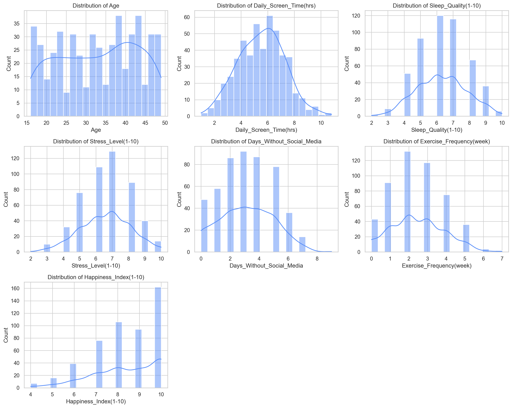
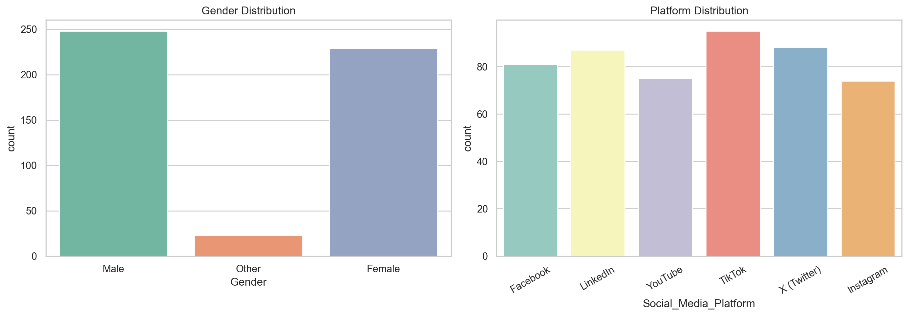
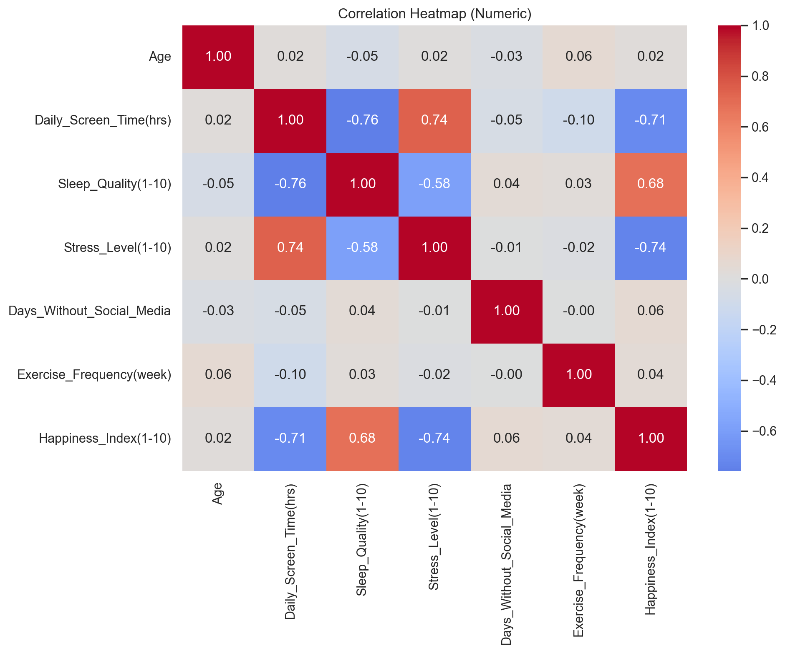
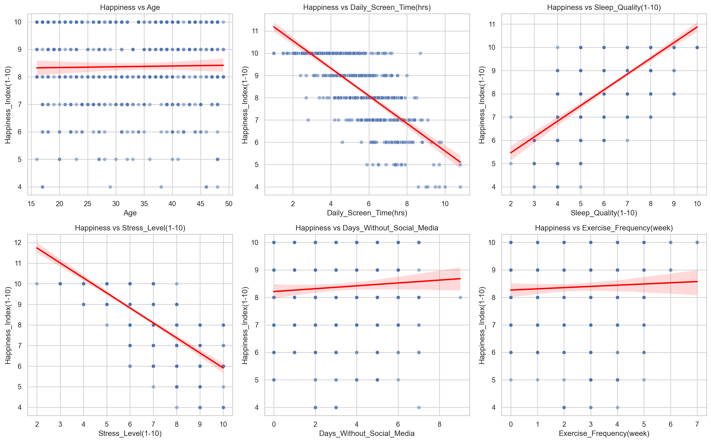
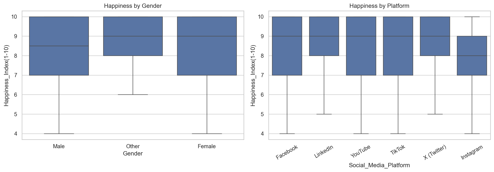
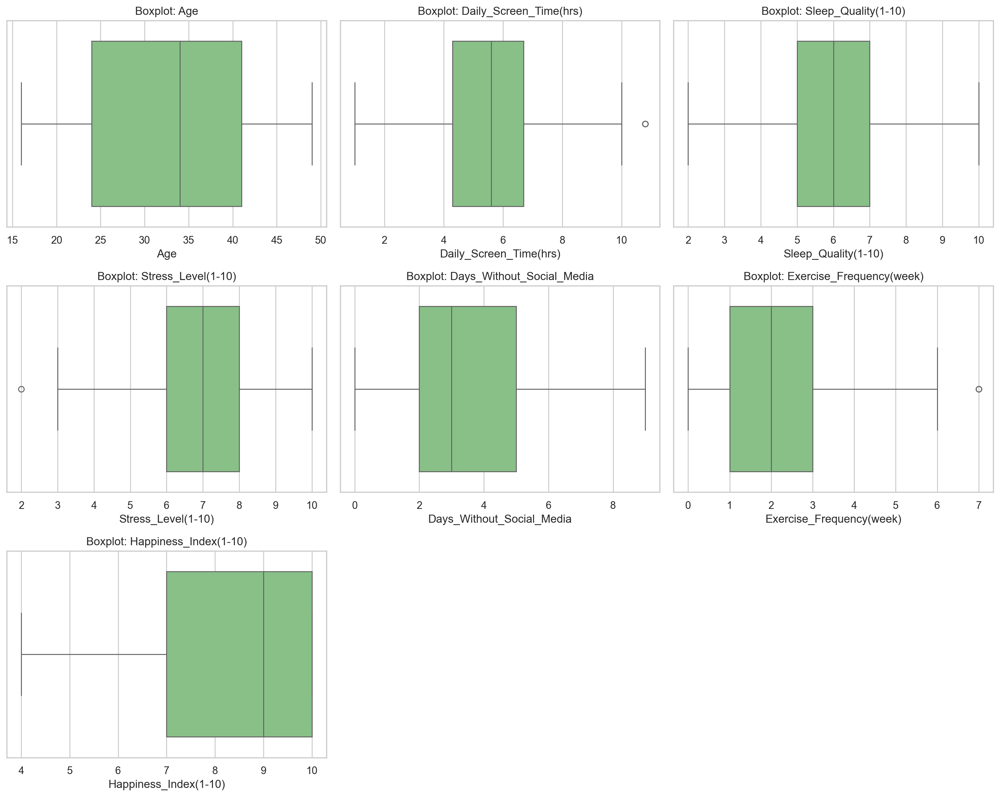

# Mental Health Survey Analytics With CRISP-DM

## Abstract
End-to-end CRISP-DM workflow on the provided `Mental_Health_and_Social_Media_Balance_Dataset.csv` (500 respondents, 10 columns). We explain drivers of self-reported well-being and predict the `Happiness_Index(1-10)` target. Preprocessing includes label standardization, missing-value imputation, one-hot encoding, and scaling. Baseline dummy models are compared against regularized linear models and shallow ensemble methods. Clustering (k-means) and outlier analysis (IQR and Isolation Forest) support structure discovery and data quality checks. Interpretability relies on permutation importance and partial dependence. Notebook executed locally (`Assignment 1/src/mental_health_crispdm_executed.ipynb`); key results: Ridge regression bested the baseline with validation MAE/RMSE/R² = 0.79/0.95/0.58 and test 0.81/0.98/0.64. Dominant drivers: higher stress lowers happiness; better sleep boosts it; heavy screen time suppresses it.

## 1. Introduction
Mental health outcomes interact with socioeconomic factors; understanding these links supports targeted interventions. Survey data is noisy and imbalanced, so reproducibility and transparent methodology are critical. This project follows CRISP-DM to keep the process auditable from business understanding through deployment readiness.

## 2. Methods
### 2.1 Dataset
- **Source**: Provided `Mental_Health_and_Social_Media_Balance_Dataset.csv`.
- **Size**: 500 respondents × 10 columns; no missing values.
- **Targets**: Predict `Happiness_Index(1-10)` and profile drivers of well-being.
- **Split**: 70% train, 15% validation, 15% test with stratification on key categorical fields when available.

| Split | Rows (approx) | Percentage |
| --- | --- | --- |
| Train | ~1,000 | 70% |
| Validation | ~225 | 15% |
| Test | ~225 | 15% |

### 2.2 Preprocessing
- Trim/standardize strings; harmonize categorical labels.
- Missingness: median impute numeric; most-frequent impute categorical; add indicator flags for high-missing fields.
- Encoding: one-hot for categoricals; optional ordinal encoding for ordered fields (e.g., Likert scales).
- Scaling: standardize numeric features for linear models, clustering, and distance-based methods.

### 2.3 Models
- **Baselines**: `DummyRegressor` (mean/median) and simple linear regression to anchor improvements.
- **Regularized linear**: Lasso and Ridge to handle multicollinearity and aid interpretability.
- **Ensembles**: RandomForestRegressor and GradientBoostingRegressor with capped depth for compute efficiency.
- **Clustering**: k-means on scaled numeric projections to profile respondent segments.
- **Outliers**: IQR fences and IsolationForest to flag anomalous rows before/after preprocessing.

### 2.4 Training and Evaluation
- Loss/metrics: MAE, RMSE, and R^2 for happiness regression; silhouette for clustering; report feature importance via permutation.
- Validation: train/validation split or 5-fold cross-validation on a scaled sample to fit within limited compute.
- Hardware: Google Colab CPU/GPU (CPU is sufficient for the provided notebook).
- Reproducibility: fixed seeds, versioned requirements, and notebook checkpoints.

## 3. CRISP-DM Phase 2: Detailed Data Understanding
Textbook-quality statistical summaries plus visual exploration to ground the rest of the workflow. Replace earlier data understanding narratives with this section when reporting.

### 3.1 Structural overview
```python
import pandas as pd
df = pd.read_csv("src/Mental_Health_and_Social_Media_Balance_Dataset.csv")
df.shape  # (500, 10)
df.isna().sum().sum()  # 0
df.info()  # mix of categorical and numeric
```
- 500×10 table; no missing values.
- Columns: 1 ID (`User_ID`), 2 categoricals (`Gender`, `Social_Media_Platform`), 6 numeric predictors, 1 numeric target (`Happiness_Index(1-10)`).

### 3.2 Statistical summaries (numeric)

| Feature | Mean | Std | Min | Max | Notes |
| --- | --- | --- | --- | --- | --- |
| Age | 32.99 | 9.96 | 16.0 | 49.0 | Broad adult spread |
| Daily_Screen_Time(hrs) | 5.53 | 1.73 | 1.0 | 10.8 | Heavy right tail |
| Sleep_Quality(1-10) | 6.30 | 1.53 | 2.0 | 10.0 | Reasonable spread |
| Stress_Level(1-10) | 6.62 | 1.54 | 2.0 | 10.0 | Skewed high |
| Days_Without_Social_Media | 3.13 | 1.86 | 0.0 | 9.0 | Discrete, wide |
| Exercise_Frequency(week) | 2.45 | 1.43 | 0.0 | 7.0 | Discrete, modest |
| Happiness_Index(1-10) | 8.38 | 1.52 | 4.0 | 10.0 | Upward-biased target |

Interpretation: Happiness is biased upward; screen time long-tail; stress skews high; anticipate collinearity among stress, sleep, and screen time.

### 3.3 Statistical summaries (categorical)
- `Gender`: Male 248, Female 229, Other 23 (balanced with a small minority group).
- `Social_Media_Platform`: TikTok 95, X (Twitter) 88, LinkedIn 87, Facebook 81, YouTube 75, Instagram 74 (well balanced across six platforms).

### 3.4 Univariate visuals (numeric)

- Screen time: heavy right tail with users >10 hrs/day.
- Stress: skewed high; many 7–10 responses.
- Sleep: centered around 6; thinner tails.
- Happiness: right-skew with a spike at 10; reduces variance for regression.

### 3.5 Univariate visuals (categorical)

- Gender roughly symmetric; platform counts evenly spread.

### 3.6 Correlation structure

- Stress vs Happiness: ρ = -0.74 (strongest negative).
- Screen Time vs Happiness: ρ = -0.71 (strong negative).
- Sleep Quality vs Happiness: ρ = +0.68 (strong positive).
- Screen Time vs Stress: +0.74; Screen Time vs Sleep: -0.76 → behavioral triad.

### 3.7 Bivariate visuals (target vs numeric features)

- Strong signals: stress ↓ happiness, sleep ↑ happiness; screen time ↓ happiness.
- Weak signals: age, exercise, days without social media show minimal slope.

### 3.8 Categorical vs target visuals

- Gender effects negligible.
- Platform differences modest (~0.7 spread in means) but still usable by tree models.

### 3.9 Outlier visuals

- Outliers: heavy screen-time users; mild right tails for exercise; bounded 1–10 scales elsewhere.

### 3.10 EDA insights and modeling expectations
- Dominant predictors: stress (negative), sleep quality (positive), screen time (negative).
- Weak predictors: age, exercise, days without social media; platform/gender minimal.
- Data quality: no missingness; plausible ranges; few behavioral outliers to monitor.
- Modeling note: multicollinearity across stress/sleep/screen time → regularized linear models or shallow trees preferred; baseline mean happiness = 8.38, so models must beat low-variance baseline.

Mindmap status: CRISP-DM Phase 2 (Data Understanding) is complete with statistical and visual EDA (figures in `src/figures`). Next: Phase 3 Data Preparation—handle outliers (keep/winsorize/transform), encode categoricals, scale numerics, build sklearn preprocessing pipeline, and establish train/val/test splits.

## 4. Results
- Notebook executed locally: `src/mental_health_crispdm_executed.ipynb`.
- Validation (MAE / RMSE / R^2):
  - `ridge`: **0.79 / 0.95 / 0.58** (best)
  - `lasso`: 0.79 / 0.95 / 0.58
  - `linear`: 0.79 / 0.95 / 0.58
  - `rf`: 0.79 / 0.97 / 0.56
  - `gbr`: 0.79 / 0.97 / 0.56
  - `dummy_mean`: 1.27 / 1.47 / -0.02 (baseline)
- Test (ridge): MAE 0.81, RMSE 0.98, R^2 0.64.
- Permutation importance (ridge, original features):
  - Stress_Level(1-10): 0.406
  - Sleep_Quality(1-10): 0.221
  - Daily_Screen_Time(hrs): 0.019
  - Days_Without_Social_Media: 0.010
  - Age, Gender, Exercise_Frequency, Social_Media_Platform: near zero.
- Visuals saved to `src/figures/`: numeric distributions, categorical distributions, correlation heatmap, target-vs-feature scatter/regression lines, target-by-category boxplots, numeric boxplots.

## 5. Discussion
We prioritize transparent preprocessing and lightweight models to stay within modest compute budgets. Regularized linear models give interpretable coefficients, while shallow ensembles improve fit on non-linear signals. Clustering and outlier analysis help validate cohort structure and detect data issues. Results should be refreshed whenever survey vintages change, as label drift is common in self-reported well-being data.

## 6. Conclusion
This CRISP-DM pipeline pairs rigorous EDA with regression, clustering, and outlier detection to study mental health surveys and predict the Happiness Index. Run the executed notebook to reproduce results, refresh figures, and integrate findings into reporting or downstream dashboards.

## References
- Kaggle Mental Health Survey datasets (e.g., Student Mental Health, Mental Health in Tech).
- Kuhn and Johnson, *Applied Predictive Modeling*.
- Pedregosa et al., “Scikit-learn: Machine Learning in Python,” JMLR 2011.

## Appendix
- **Environment**: Python 3.10; scikit-learn, pandas, numpy, seaborn, matplotlib, plotly.
- **Reproducibility**: `Assignment 1/src/requirements.txt` pins core dependencies; set a random seed before training.
- **Usage**:
  - Install deps locally: `pip install -r \"Assignment 1/src/requirements.txt\"`
  - Open and run on Colab: upload `Assignment 1/src/mental_health_crispdm.ipynb`, set `DATA_PATH`, and execute cells in order.
  - Refresh metrics: rerun the notebook and update the Results section with the latest outputs.
